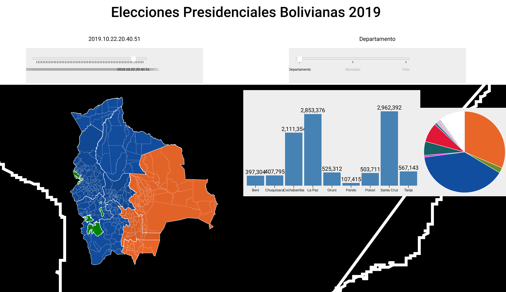

# Election Results


## Motivation
Elections come around and there is no easy tool to visualize result. I've
tried as hard as possible to stay generic and make everything modular, but
data is hard.

this project was originally forked from
https://github.com/aspittel/election-map/ but most of it was now rewritten.

## Bolivia 2019
I'm using this project to map out results as they are uplodade to
https://trep.oep.gob.bo and https://computo.oep.gob.bo, ideally i'd like to
show variance and projections visualisations with historical data.

### Bolivia workflow
i get the xlxs files from the OEP website, then i run this little script on them
```sh
#!/bin/sh
set -x

RUNNER="python3 ../../main.py"
files=`ls *.xlsx`
mkdir -p pais municipio departamento
for i in $files; do
        xlsx2csv $i > $i.csv
        $RUNNER $i.csv --field 'País' > pais/pais-$i.csv
        $RUNNER $i.csv --field 'Departamento' --only "País=Bolivia" > departamento/departamento-$i.csv
        $RUNNER $i.csv --field 'Municipio' --only "País=Bolivia" > municipio/municipio-$i.csv
        rm -rf $i.csv
done
```

## data
the data folder is volunterly left out of this repo so that i don't clutter
developement with data updates. that said you should probably still be able
to grab it from https://xaiki.net/~xaiki/elecciones or some of it's subdirs

## main.py
this very poorly named tool could be a great companion for you, it'll take
csv data and allow you to filter/agregate by diferent fields, it's really
written only to slove my problem today but, patches are welcome
